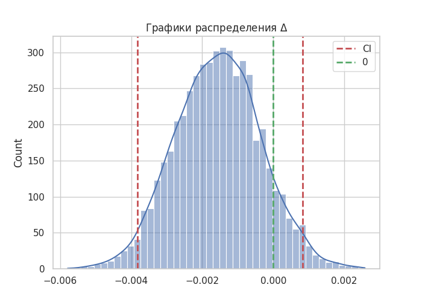
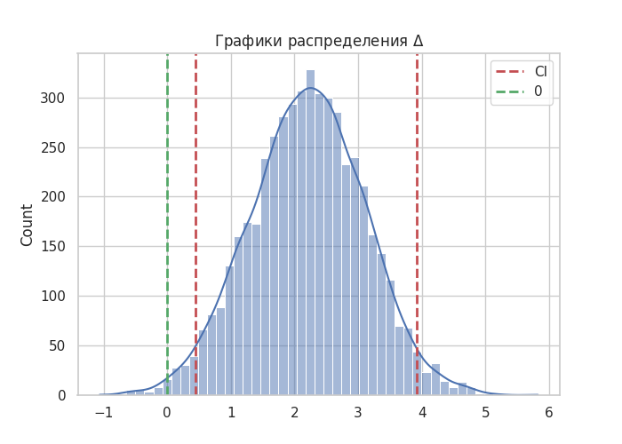

# README.MD 

## О проекте

В этом репозитории показан процесс проведедения AB-теста для для датасета Ecommerce-AB-Testing-2022. Датасет предполагает следущую задачу: компания разработала новую веб-страницу, чтобы попытаться увеличить число пользователей, которые "конвертируются", то есть количество пользователей, которые решают заплатить за продукт компании. Цель - поработать с предоставленными данными, чтобы помочь компании понять, следует ли ей внедрить новую страницу, сохранить старую. 
Имеется две группы одинакового размера -- контрольная и тестова, тестовая группа наблюдала новый дизайн веб-страницы, контрольная группа наблюдала старый дизайн веб-страницы. 

Исходный датасет содержит только бинарную метрик `converted`, но в бизнесе рост конверсии не всегда ведет к росту прибыли, ключевой метрикой в конечном итоге является выручка. Поэтому для проведения полноценного эсперимента я расширил датасет синтетическими данными о выручке:
-  `converted` = 1 интерпретируется как факт покупки.
- Предположим, что на новой странице есть блок рекомендаций к покупке, что в теории должно увеличить средний чек, при этом не влияя на конверсию.
- Сумма выручки модериловаралсь с использованием экспоненциального распределения.

---

## EDA

На этапе EDA было выявлено, что данные довольно чистые. Удалены пользователи которые не соответсвуют условиям экспермента, например, юзер из тестовой группы наблюдал старый дизайн. Базовое сравнение групп показало, что для обе группы сбалансированы и в обеих группах примерно 88% пользователей не конвертировались.

Итого были выполнены: 
- проверка структуры данны;
- очистка данных;
- базовое сравнение групп;

--- 

## SRM

Проверена гипотеза равенства долей пользователей в контрольной и тестовой группах:
- $H_{0}: P(control) = P(treatment) = 0.5$

Значени, p-value=0.94528 для критерия хи-квадрат показало, что нет оснований полагать эксперимент некорректным.

---

## Проверка гипотез для конверсии 

Проведен двусторонний тест и пуассоновский бутстрап и сформуилованы следующие гипотезы при уровне значимости $\alpha=0.05$:
- $H_{0}$: конверсия контрольной группы равна конверсии тестовой группы, $P(contorl)$ = $P(test)$ 
- $H_{1}$: конверсия контрольной группы $\ne$ конверсии тестовой группы, $P(contorl) \ne P(test)$

Для двустороннего z-теста для пропорций p-value=0.18965 позволяет сделать вывод о том, что нет статистических значимыхпричин отвергунть $H_{0}$, а значит конверсии между группами равны.
При построении доверительных интервалов с помощью бутстрапа, ноль оказался внутри доверительного интервала, что также говорит о том, что нет статистических оснований, чтобы отвергнуть $H_{0}$.

---

## Моделирование эффекта и расчет MDE
В текущем блоке предполагется сценарий где новая версия страницы не меняет конверсию, но увеличивает средний чек. Для тестовой группы был смоделирован эффект в 5%.
Рассчитаный MDE показывает:
- при текущем объеме данных минимальный различимы эффект ~ **2.5** денежных единиц.
- если эффект есть, то мы заметим его с вероятностью > 0.8.

---

## Проверка гипотез для среднего чека
Сформулированы следующие гипотезы:
- $H_{0}$: $\overline{X_{t}} = \overline{X_{с}}$ 
- $H_{1}$: $\overline{X_{t}} \ne \overline{X_{с}}$ 

Двусторонний t-тест: 
- t-критерий: -2.42937
- p-value: 0.01513

При $\alpha = 0.05$ наблюдаемые различия являются статистически значимыми (p-value < 0.05), что позволяет отвергнуть нулевую гипотезу $H_{0}$ в пользу альтернативной $H_{1}$.

После построения 97.5% доверительного интервала методом классического бутстрапа было обнаружено, что 0 не попадает в полученный интервал. Это означает, что наблюдаемый эффект статистически значим на уровне 2.5%, поэтому мы также отвергаем нулевую гипотезу $H_{0}$ в пользу альтернативной $H_{1}$.

## Выводы 
- SRM отсутствует.
- Конверсия между тестовой и контрольной группой статистически не различается.
- Проведен эксперимент с расширением AB-теста.
