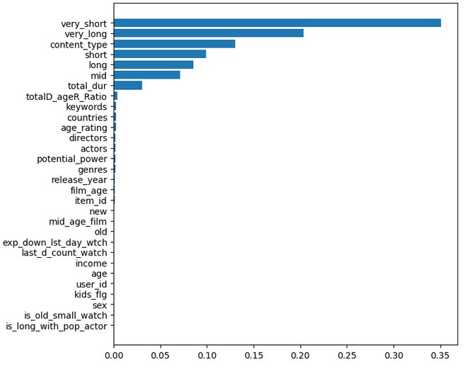
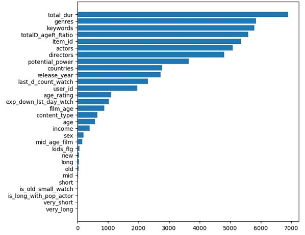

# README.md

## О проекте
В этом репозитории показан процесс решения задачи прогноза вовлеченности пользователей.
Необходимо было определить, досмотрит ли пользователь видео более чем на 50%, то есть стояла задача бинарной классификации.
В ходе анализа данных и построения признаков были выполнены целевые преобразования, обработка пропусков, отбор и генерация признаков, а также обучение ансамбля моделей XGBoost и LightGBM с последующим блендингом их предсказаний.
Финальный результат составил F1-score = **97.65%**.
---

## Предобработка и EDA
- Удалены столбцы `for_kids` и `studios` — в обоих >96% пропусков, практически нет сигнала.  
- Удалены столбцы `title`, `title_orig` — отсутствие адекватного отклика модели.  
- Из датасета удалено **144 строки**, где целевая переменная равна нулю.  
- Пропуски в `sex`, `age`, `income` заменены на класс-заглушку `UNKNOWN`.  
- Объединены `income`, `income_90_150`, `income_150_inf` в один признак.  

---

## Feature engineering
- Преобразование категорий возраста и дохода в средние значения (например, `age_18_24` → `21`, `income_0_20` → `10` и т.д.)  
- `last_watch_dt` → создан признак `last_d_count_watch`: число дней с последнего просмотра относительно максимальной даты.  
- `release_year` → создан признак `film_age` и его категориальная версия (`new`, `mid_age_film`, `old`).  
- `total_dur` переведён в часы, логарифмирован и разбит на 5 категорий: `very_short`, `short`, `mid`, `long`, `very_long`.  
- `actors`, `keywords`, `directors`, `countries`, `genres` — FrequencyEncoding с L1-нормой (из вектора категорий получали скаляр).  

---

## Модели
Использовались два бустинга с косинусным расписанием обучения:  
- **XGBoost**  
- **LightGBM**  

**Параметры XGBoost:**
```
n_estimators=1000
eta=0.1
reg_lambda=1
reg_alpha=0.003
max_depth=18
colsample_bytree=0.8
subsample=0.9
```
**Параметры LightGBM:**
```
n_estimators=2000
learning_rate=0.05
max_depth=18
num_leaves=30
reg_alpha=1
reg_lambda=0.003
n_jobs=-1
```

---

## Результаты
- XGBoost выделил самой важной фичей `total_dur` и производные.  
- LightGBM — `content_type`, `total_dur`, `film_age`.  
- Обе модели по отдельности: **F1-score ≈ 97.4+%**  
- Финальный блендинг: **F1-score = 97.65%**  

---

## Графики важности признаков



---


